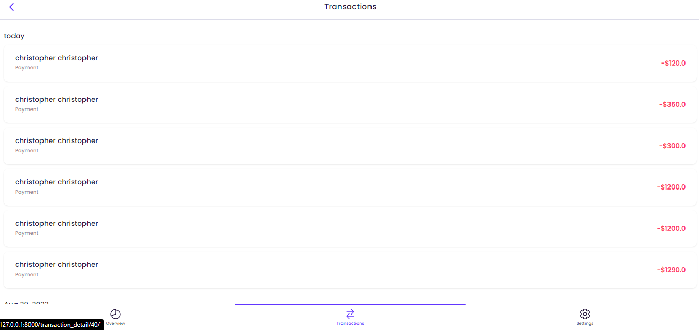

# Bank System Project

**Author:** Arinze Timothy




## Table of Contents

- [Overview](#overview)
- [Features](#features)
- [Prerequisites](#prerequisites)
- [Installation](#installation)
- [Usage](#usage)

## Overview

    The Bank System Project is a web-based banking application developed using Django. This project provides a comprehensive banking system with features such as user account management, fund transfers, notifications, referral, kyc, 2 Step Verification and OTP and more.

## Features

    - User registration and authentication
    - User account management
    - Broadcast email to selected users
    - Fund transfer between users
    - Notification system
    - Referral program
    - Transaction history
    - Download Transaction Details in PDF Format
    - Generate Transactions statements by selecting the start and end date
    - Account verification via email or SMS
    - Loan management 
    - New Device Detection (User gets an OTP if signed in with another device)
    - Chat with support if there's any issue

## Prerequisites

    - Python (version 3.10)
    - Django (version 3.2)
    - [Other dependencies, if applicable]

## Installation

    Follow these steps to set up and run the project locally:

1. Clone the repository:

   ```bash
   git clone https://github.com/your-username/bank-system.git

2. Change into the project directory:

    ```bash
    cd bank-system

3. Install dependencies:
    ```bash
    pip install -r requirements.txt

4. Apply database migrations::
    ```bash
    python manage.py migrate
    python manage.py makemigrations

5. Create a superuser for administrative access:
    ```bash
    python manage.py createsuperuser

6. Start the development server:
    ```bash
    python manage.py runserver